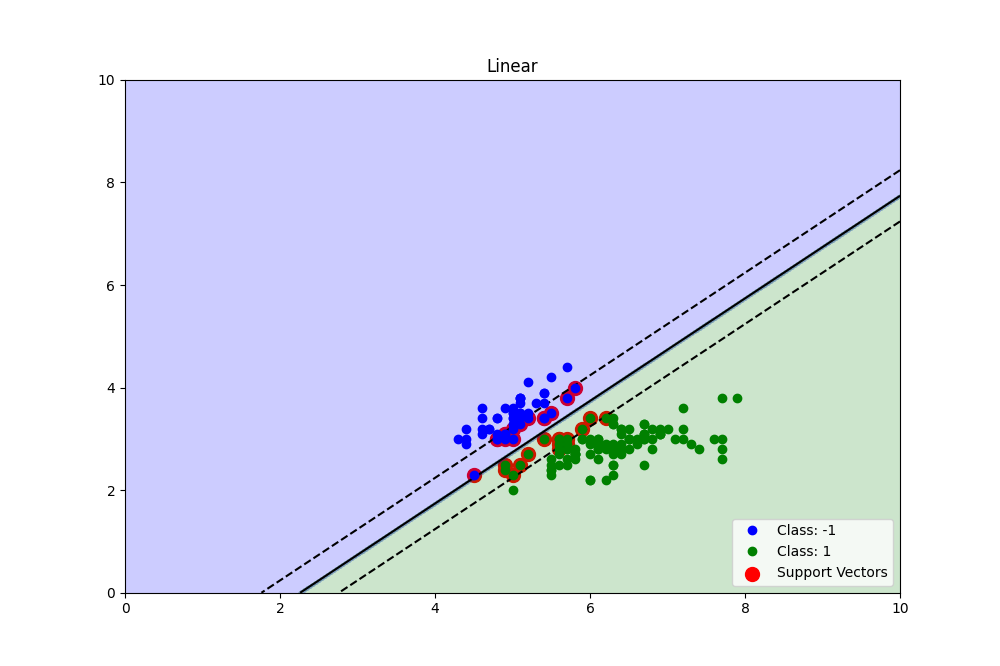
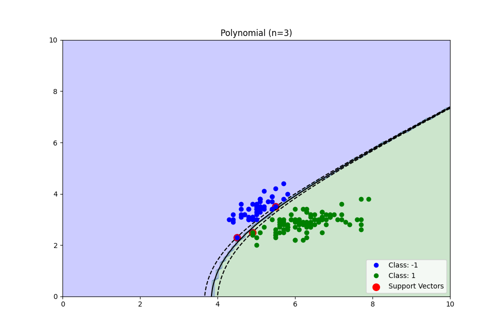
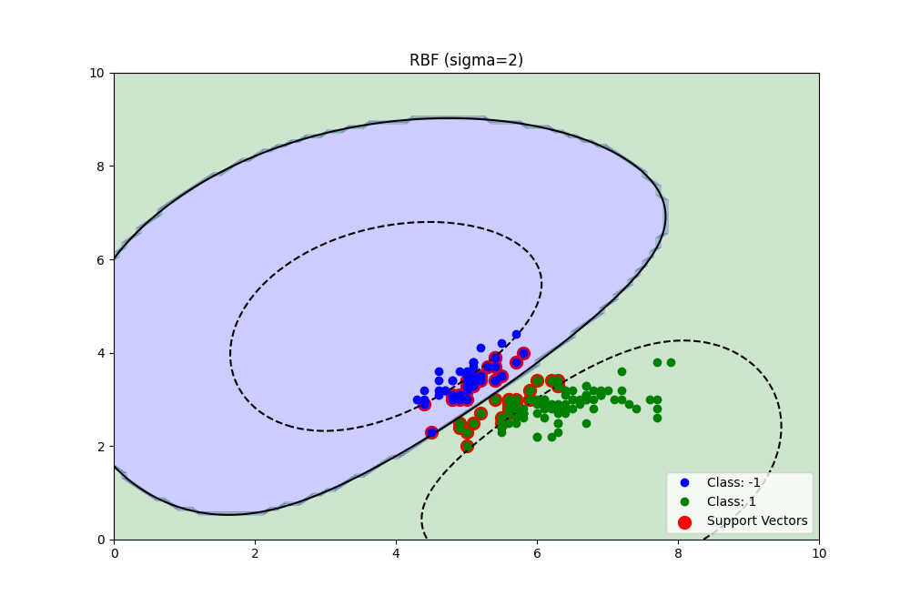

# Quadratic Programming Soft-Margin Kernel SVC

Building a soft-margin svc with kernel parameter using numpy and cvxopt. 

**Note:** The sklearn/libsvm implementation uses the SMO (sequential minimal optimisation) algorithm, which is much faster than the off-the-shelf QP solver in cvxopt. 

**Plots on Iris:**

